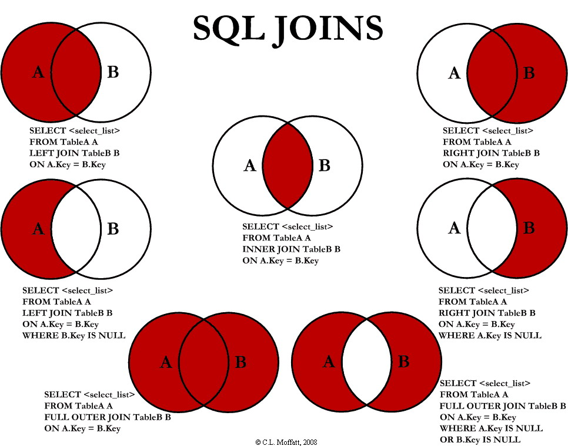

# Intro to SQL

Tools:

- SQLite3 => C-Language library SQL database engine
- SQLite Browser => Visual User Interface for interacting with sql/sqlite3
- chinook database => Microsoft curated Open source database
- PostgreSQL(elephant)
- MySQL(2) => Library that interacts with db

  NoSQL
- MongoDB (Non-Relational Dbs)

## What is SQL?

  - Structured Query Language?
  - Language that Communicates with our database
  - Are SQL only jobs
  - Request / Response Cycle
    - Req -> Send a QUERY to our (String with parameters)
    - Res -> Sends back data based off of the request
  - Relational Databases
    - Each table can commuincate with each other
    - Can go through as many relationshiped tables using the FORIEGN KEY
      - Foriegn Key => the primary key of the BELONGS_TO(Child) relationship
  - SINGLE SOURCE OF TRUTH!
    - The origin of certain data
    - DO NOT REPEAT YOURSELF (But now in SQL)
      - Reduce the amount of Memory
      - For any Aggregate methods, can calculate using data from one or many tables
    - Benifits
      - Eliminate Confusion
      - Accurate Data
        - Not Rely on updating all associated data
      - Time/Memory Complexity
      - Easier to debug

## Why use SQL databases?

  - Persistance
  - Great tool for Large Datasets
  - Faster than JS 
  - Simple to Use

## What are some DB Examples?

  - Music Library 
  - Excel
  - Wikipedia
  - Game assets, scores
  - Pet tracking system
  - Gambling data
  - Machine Learning Data

## What kind of operations can we do in SQL?
  - Create (Write, add) => INSERT
  - Read => SELECT, SORT, GROUP...
  - Update => UPDATE
  - DELETE => DELETE

## What are the Datatypes in SQL/db?

  - Strings
    - TEXT
    - CHAR
    - VARCHAR
  - Numbers
    - INT (INTEGER)
    - BIGINT
    - FLOAT
    - REAL
  - Dates
    - DATE
    - DATETIME
    - TIMESTAMP
  - BOOL
  - BLOB => BINARAY LARGE OBJECT => Binary respresentations of images/audio/video

## How to make SQL Queries

1. .sql files
2. run sqlite3 terminal
3. run sqlite3 browser

## SQLite3 tips

to run the default sqlite terminal:
sqlite3

to run the sqlite terminal with a database:
sqlite3 <chinook.db>

to run a sql query on a database:
sqlite3 <chinook.db> < <file.sql>

## Relational Databasing

Foriegn Keys => table ids (keys) from the parent (hasmany) table on the current table

PRAGMA table_info(table_name); => show columns

## Resources

- https://www.sqlitetutorial.net/sqlite-sample-database/
- https://www.pgexercises.com/
- https://www.digitalocean.com/community/tutorials/sqlite-vs-mysql-vs-postgresql-a-comparison-of-relational-database-management-systems

